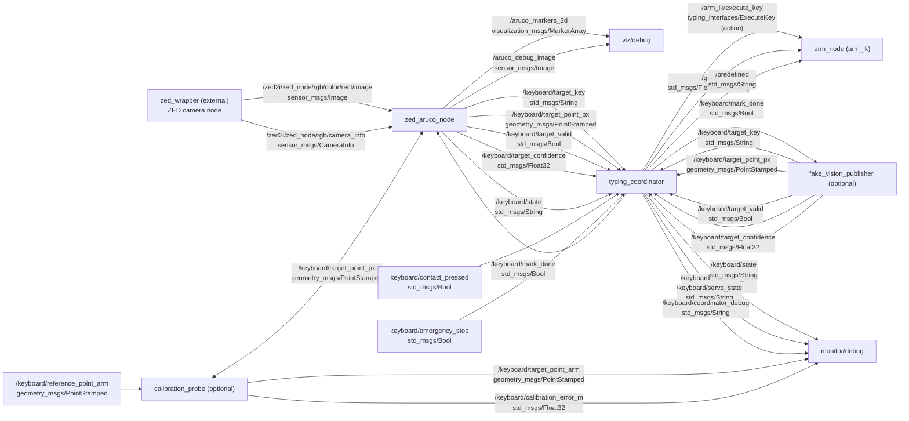

# autonomous_typing_zed

ROS 2 Humble stack for detecting ArUco markers with a ZED camera and driving a robot arm to press keyboard keys. The system targets Jetson Orin Nano and is tuned for URC-style closed-loop typing.

## Architecture (ROS 2 Humble)
Packages and main nodes:

- **zed_aruco**
  - `zed_aruco_node`: ZED image ingest, ArUco detection, keyboard pose + target key tracking.
  - `typing_coordinator`: converts vision targets into arm goals and drives the ExecuteKey action.
  - `calibration_probe`: optional TF-based calibration helper.
  - `fake_vision_publisher` / `fake_execute_key_server`: no-hardware simulation.
- **typing_interfaces**
  - `ExecuteKey.action`: action interface used by the coordinator to command the arm.
- **arm_ik**
  - `arm_node`: action server `/arm_ik/execute_key` plus legacy `/goal` and `/predefined` topics.
- **aruco_py**
  - `aruco_node`: standalone ArUco detector (non-ZED image sources).

## ZED -> ArUco -> Typing Flow
1) ZED camera publishes rectified color images (e.g. `/zed2i/zed_node/.../image`).
2) `zed_aruco_node` detects ArUco markers, estimates keyboard pose, and publishes:
   - `aruco_markers_3d` (MarkerArray), `aruco_debug_image` (Image)
   - `keyboard/target_key`, `keyboard/target_point_px`, `keyboard/target_valid`, `keyboard/target_confidence`, `keyboard/state`
3) `typing_coordinator` consumes the keyboard targets, applies safety/servo logic, and sends `ExecuteKey` goals to the arm.
4) `arm_node` executes the goal or runs in dry-run mode (safety default).

## Target Hardware
- **Compute:** Jetson Orin Nano
- **Camera:** Stereolabs ZED (tested with ZED2i topics)
- **Arm:** action server in `arm_ik` (hardware integration external to this repo)

## Runtime Notes
- See [RUNTIME_COMMANDS.md](RUNTIME_COMMANDS.md) for the step-by-step URC bring-up.
- See [src/zed_aruco/README.md](src/zed_aruco/README.md) for launch options and servo parameters.

## Data Flow (ROS 2 Humble) - Topics, Params, TFs

### Topic Diagram (Mermaid)

### Configuration Parameters (critical defaults)
| Parameter | Default | Function |
|---|---|---|
| zed_aruco_node.image_topic | /zed2i/zed_node/rgb/color/rect/image | ZED image topic used for ArUco detection. |
| zed_aruco_node.marker_size | 0.1 | Physical marker size (m). |
| zed_aruco_node.aruco_dictionary | DICT_4X4_50 | ArUco dictionary. |
| zed_aruco_node.target_key_label | "" | Force a specific key label (if used). |
| zed_aruco_node.homography_hold_seconds | 1.0 | Homography persistence after marker loss. |
| zed_aruco_node.marker_ref_is_bottom_right | false | Marker reference corner (OpenCV default TL). |
| typing_coordinator.action_name | /arm_ik/execute_key | Arm action server. |
| typing_coordinator.done_topic | keyboard/mark_done | Key completion signal. |
| typing_coordinator.target_z | 0.12 | Press target Z (m). |
| typing_coordinator.target_roll | 0.0 | Target roll (deg). |
| typing_coordinator.target_pitch | 0.0 | Target pitch (deg). Vertical-panel geometry — horizontal gripper push. |
| typing_coordinator.min_confidence | 0.3 | Minimum target confidence. |
| typing_coordinator.required_state | TRACKING | Required state before moving. |
| typing_coordinator.goal_cooldown_sec | (fixed) | Cooldown between goals (constant in code). |
| typing_coordinator.accept_dry_run_result | false | Accept dry-run results as success. |
| typing_coordinator.use_tf_targeting | true | Use TF (camera->arm) for mapping. |
| typing_coordinator.arm_base_frame | arm_base | Arm base frame. |
| typing_coordinator.camera_frame | "" | Camera frame; if empty, uses msg frame_id. |
| typing_coordinator.keyboard_plane_z_m | 0.45 | Keyboard plane depth from camera (m). |
| typing_coordinator.camera_fx/fy | 700.0 | Camera intrinsics. |
| typing_coordinator.camera_cx/cy | 640.0 / 360.0 | Optical center (px). |
| typing_coordinator.arm_z_offset | 0.0 | Extra Z offset (m). |
| typing_coordinator.motion_enabled | false | Safety gate for motion. |
| typing_coordinator.require_transform_valid | true | Require valid TF before moving. |
| typing_coordinator.servo_mode_enabled | false | Enable continuous YZ servo + press/retract (vertical panel). |
| typing_coordinator.contact_topic | keyboard/contact_pressed | Contact input. |
| typing_coordinator.emergency_stop_topic | keyboard/emergency_stop | Immediate hold (no retract). |
| typing_coordinator.servo_y_gain_m_per_px | 0.00035 | Horizontal pixel error → arm-y gain. |
| typing_coordinator.servo_z_gain_m_per_px | 0.00035 | Vertical pixel error → arm-z gain. |
| typing_coordinator.servo_ki_y_per_px_per_s | 0.0001 | Integral gain for Y (PI alignment). |
| typing_coordinator.servo_ki_z_per_px_per_s | 0.0001 | Integral gain for Z (PI alignment). |
| typing_coordinator.servo_deadband_px | 4.0 | PI deadband (px). |
| typing_coordinator.servo_xy_step_max_m | 0.003 | Max YZ step per update. |
| typing_coordinator.servo_align_enter/exit_thresh_px | 8.0 / 12.0 | Alignment hysteresis. |
| typing_coordinator.servo_align_stable_cycles | (fixed) | Stable cycles before press (constant in code). |
| typing_coordinator.servo_cmd_cooldown_sec | (fixed) | Servo command cooldown (constant in code). |
| typing_coordinator.servo_press_step_m | 0.0015 | Press step along arm-x (into panel). |
| typing_coordinator.servo_press_max_travel_m | 0.015 | Max press travel along arm-x. |
| typing_coordinator.servo_press_timeout_sec | 2.0 | Press timeout. |
| typing_coordinator.servo_press_direction_sign | +1.0 | +1.0 presses into panel (+arm-x). |
| typing_coordinator.servo_retract_step_m | 0.0025 | Retract step along arm-x back to hover. |
| typing_coordinator.return_to_base_command | INTERMEDIATE | Predefined pose name for return-to-base. |
| typing_coordinator.debug_publish_period_sec | 0.25 | Debug publish period (s). |
| typing_coordinator.image_center_x/y | 640.0 / 360.0 | Image center for heuristic mapping. |
| typing_coordinator.base_x/base_y | 0.25 / 0.0 | Vertical-panel mapping: base_x = panel-face arm-x; base_y = arm-y at horizontal center. |
| typing_coordinator.scale_y_per_px | 0.00035 | Horizontal px → arm-y scale. |
| typing_coordinator.scale_z_per_px | 0.00035 | Vertical px → arm-z scale. |
| calibration_probe.arm_base_frame | arm_base | Arm base frame for TF. |
| calibration_probe.camera_frame | "" | Camera frame; if empty, uses msg frame_id. |
| calibration_probe.keyboard_plane_z_m | 0.45 | Keyboard plane depth (m). |
| calibration_probe.camera_fx/fy/cx/cy | 700/700/640/360 | Camera intrinsics. |
| fake_vision_publisher.frame_id | zed2i_left_camera_optical_frame | Frame for target_point_px. |
| fake_vision_publisher.publish_rate_hz | 10.0 | Publish rate. |
| fake_execute_key_server.result_mode | success | Simulated action result mode. |
| fake_execute_key_server.delay_sec | 0.2 | Simulated action delay. |
| arm_node.publish_on_action | false | Publish joints only if action allows. |
| aruco_py.aruco_advanced.yaml (template) | (see file) | Standalone detector tuning template for `aruco_py`. |

Timers / rates:
- typing_coordinator.tick: 0.1s (10 Hz)
- typing_coordinator.debug: max(0.05, debug_publish_period_sec)
- calibration_probe.tick: 0.1s (10 Hz)
- fake_vision_publisher.tick: 1.0 / publish_rate_hz

### TF Frame Mapping (detected)
- arm_base -> zed2i_left_camera_optical_frame (optional via static_transform_publisher)
- camera_frame -> arm_base (used by typing_coordinator and calibration_probe when use_tf_targeting=true)
- keyboard_plane_z_m is a virtual plane in the camera frame
